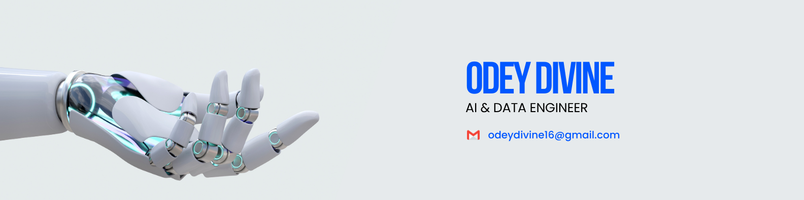

# Hi, I'm Odey Divine 👋

I'm a Data Analyst turned **AI & Data Engineer**, passionate about building intelligent systems that turn raw data into real impact.

Currently interning as a **Machine Learning Engineer** and sharpening my skills in **Data Engineering**, **Data Science**, and **Generative AI**.

---

## 🔭 What I'm Working On

- **Machine Learning & GenAI** — Building models and AI-powered solutions @Flyrank AI
- **Data Engineering** — Learning pipelines, ETL, and cloud infrastructure @CIL Academy
- **Data Science** — Exploring ML, LLMs, and real-world applications @DataraFlow
- **Full-Stack Foundations** — HTML, CSS, Tailwind, JavaScript, and React (coming soon)

---

## 📌 Featured Projects

| Project | Description | Tools |
| :--- | :--- | :--- |
| **[GlobalTech Workforce Dashboard](https://github.com/OdeyDivine/GlobalTech-Solutions)** | Interactive Excel dashboard analyzing workforce headcount, compensation, and experience. | `Excel` `Data Viz` `Dashboard Design` |
| **[Adidas US Sales Analysis](https://github.com/OdeyDivine/EasyTech-Adidas-Sales-Analysis)** | Exploratory analysis of Adidas sales data with product, regional, and channel insights. | `EDA` `Excel` `Figma` `Business Insights` |
| **[Titanic Survival Analysis](https://github.com/OdeyDivine/Titanic-Survival-Analysis)** | Cleaned and analyzed Titanic data to identify survival predictors using Python. | `Python` `Pandas` `Matplotlib` `Data Cleaning` |
| **[Electronics Sales Dashboard](https://github.com/OdeyDivine/Electronics-Sales)** | Power BI dashboard exploring electronics sales trends and performance. | `Power BI` `Data Modeling` `Dashboard Design` |

---

## 🛠️ Tech Stack

  
  
  
  
  
  
  
   
  
  
  
  
   
  <em>React — coming soon</em>

---

## 📈 GitHub Stats

  

  

  

---

## 🎯 Current Goals

- Build and deploy end-to-end ML and GenAI projects
- Strengthen Data Engineering skills (pipelines, cloud, orchestration)
- Contribute to open-source and collaborate with others
- Land my first full-time AI/Data Engineering role

---

## 🤝 Let's Connect

---

*Always building. Always learning. Always open to feedback, collaboration, or opportunities.*
